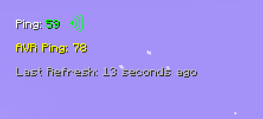

# ⚡ LatencyLite
A simple, modular Minecraft mod that shows your ping on screen — clean, customizable, and lightweight.

So minimal, it barely needs a description.

<details>
  <summary>Screenshots</summary>

  

</details>
<details>
  <summary>Default Config File</summary>

```toml
["Core Config"]
	#if it set true all functionality of mod will be disabled
	disableMod = false
	#if this config enabled, it will scale all the components of this mod
	enable_global_scaling = false
	#if this config enabled, it will avoid other local scale configs and use only Core scaling
	avoid_local_scaling = false
	#x scale of all text rendering.
	#Range: 0.0 ~ 1.0
	x_scale = 1.0
	#y scale of all text rendering.
	#Range: 0.0 ~ 1.0
	y_scale = 1.0

["Ping Config"]
	#Show ping as text on screen
	show_ping = true
	#Color of 'ping' text
	#Range: 0 ~ 16777215
	ping_color = 16777215
	#X position of 'ping' text
	#Range: 0 ~ 1920
	ping_x_pos = 15
	#Y position of 'ping' text
	#Range: 0 ~ 1080
	ping_y_pos = 20
	#X scale of 'ping' text
	#Range: 0.0 ~ 1.0
	ping_x_scale = 0.5
	#Y scale of 'ping' text
	#Range: 0.0 ~ 1.0
	ping_y_scale = 0.5

["Average Ping Config"]
	#Show average ping as text on screen
	show_avr_ping = true
	#Color of 'average ping' text
	#Range: 0 ~ 16777215
	average_ping_color = 16776960
	#X position of 'average ping' text
	#Range: 0 ~ 1920
	average_ping_x_pos = 15
	#Y position of 'average ping' text
	#Range: 0 ~ 1080
	average_ping_y_pos = 40
	#X scale of 'average_ping' text
	#Range: 0.0 ~ 1.0
	average_ping_x_scale = 0.5
	#Y scale of 'average_ping' text
	#Range: 0.0 ~ 1.0
	average_ping_y_scale = 0.5

["Last Refresh Config"]
	#Show last refresh of ping as text on screen
	show_last_refresh = true
	#Color of 'last_refresh' text
	#Range: 0 ~ 16777215
	last_refresh_color = 12632256
	#X position of 'last_refresh' text
	#Range: 0 ~ 1920
	last_refresh_x_pos = 15
	#Y position of 'last_refresh' text
	#Range: 0 ~ 1080
	last_refresh_y_pos = 60
	#X scale of 'last_refresh' text
	#Range: 0.0 ~ 1.0
	last_refresh_x_scale = 0.5
	#Y scale of 'last_refresh' text
	#Range: 0.0 ~ 1.0
	last_refresh_y_scale = 0.5


```
</details>
